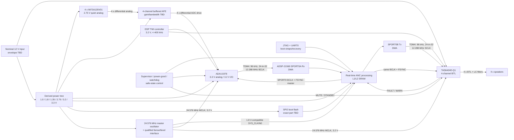

# Phase 2 - System Architecture Freeze

Repository: `circuitBuilderAi-Astra`  
Review date: 2026-09-08  
Scope: system architecture only; no schematic, PCB, KiCad, regulator, oscillator, AFE, or ANC implementation.

## 1. Executive summary

The system architecture is sufficiently defined to proceed to detailed power, clock, reset, and AFE design. The final candidate path is:

`4 x IM73A135V01 -> 4-channel differential buffered AFE -> ADAU1978 -> TDM4 -> ADSP-21569 -> TDM4 -> TAS6424E-Q1 -> 4 x BTL speakers`

Both digital-audio links use one synchronous 96 kHz domain with four 32-bit slots carrying 24-bit two's-complement audio. One ADSP-21569 SPORT is divided into independent receive and transmit halves with separate DMA channels but a shared 12.288 MHz BCLK and 96 kHz frame sync. This common framing is preferable to different SPORT formats because it is valid at all endpoints, avoids format conversion and an extra sample-rate domain, and preserves deterministic channel timing.

A single low-jitter 24.576 MHz master reference is the root of the DSP, ADC, amplifier, BCLK, and frame-sync clocks. The DSP is the BCLK/frame-sync master; the ADAU1978 and TAS6424E-Q1 are slaves. A qualified clock fanout/level interface must supply a 1.8 V-compatible DSP `SYS_CLKIN0` branch and 3.2 V-compatible ADC/amplifier MCLK branches. No oscillator or fanout part is selected here.

The provisional digital I/O strategy is direct connection on a common 3.20 V nominal rail bounded to 3.168-3.232 V at the device pins. Direct wiring remains valid only if the complete rail, powered-off, loaded timing, edge-rate, skew, and signal-integrity conditions in Section 10 are met; otherwise qualified buffering or level translation is mandatory.

The AFE is required and remains undesigned. It must buffer the microphone load, preserve four differential channels, separate microphone and ADC common-mode voltages, provide the still-unknown gain/headroom/noise/phase response, and drive the ADC differential inputs. Product inputs for ANC band, acoustic levels, microphone roles, latency, speaker load/power, and thermal environment remain UNKNOWN. They do not prevent this system architecture freeze, but they constrain detailed block design and later feasibility.

Evidence basis: the official local documents indexed in [component_evidence_index.md](../evidence/component_evidence_index.md) were checked at the cited pages. Graphify was attempted first, but no Graphify operation was exposed to this session and no `graphify-out/graph.json` was present; no graph result is claimed. Only the phase documents authorized by the task were used for repository decisions.

## 2. Final candidate block architecture

| Block | Frozen role | Status |
| --- | --- | --- |
| 4 x IM73A135V01 | Normal-mode, active differential analog microphones on a quiet 2.75 V nominal domain | **PROVISIONAL** engineering choice; device limits **CONFIRMED** |
| Four-channel AFE | One buffered differential path per microphone; AC/common-mode isolation and ADC drive | **PROVISIONAL** architecture; circuit and gain **UNKNOWN** |
| ADAU1978 | Four independent ADC channels at 96 kHz; MCLK PLL mode; TDM4 slave | **PROVISIONAL** component; capabilities **CONFIRMED** |
| ADSP-21569 | Clock/control owner; SPORT0A receive, SPORT0B transmit; DMA and real-time ANC | **PROVISIONAL** component and resource allocation |
| TAS6424E-Q1 | Four independent BTL channels; TDM4 slave; nominal 12 V PVDD/VBAT | **PROVISIONAL** component; selected audio mode **CONFIRMED** |
| Four speakers | One BTL load per channel; no PBTL | Four outputs **CONFIRMED**; load/power/thermal envelope **UNKNOWN** |

No ASRC, sample-rate conversion, channel summing, PBTL, or external DDR is included in the base architecture. External DDR may be added only if a later measured DSP workload/memory budget requires it.

## 3. Audio interface architecture

### 3.1 End-to-end contracts

| Interface | Signal and channels | Rate / word / slots | Clocking and framing | Logic domain |
| --- | --- | --- | --- | --- |
| IM73A135 -> AFE | Four independent analog differential `OUT+`/`OUT-` pairs | Continuous analog; sample/slot fields not applicable | Microphone-driven; DC output bias accepted by AFE | Microphone 2.75 V nominal analog domain |
| AFE -> ADAU1978 | Four differential analog pairs | ADC full-scale target 2 Vrms differential typical; actual utilization and margin UNKNOWN | AFE drives ADC inputs around ADC-side 1.5 V typical common mode after coupling/bias network | Quiet analog domains; exact AFE rails UNKNOWN |
| ADAU1978 -> ADSP-21569 | One TDM data line, four channels, ADC channels 1-4 in slots 1-4 | 96 kHz; signed 24-bit MSB-first audio; four 32-bit slots; 12.288 MHz BCLK | Active-high one-BCLK frame pulse; one-BCLK delay to first MSB; ADC launches on falling edge, SPORT samples rising; DSP master, ADC slave | Common bounded 3.20 V digital I/O rail |
| ADSP-21569 -> TAS6424E-Q1 | One TDM data line (`SDIN1`), four independent channels in slots 1-4; `SDIN2` unused | 96 kHz; signed 24-bit MSB-first audio; four 32-bit slots; 12.288 MHz SCLK | Active-high one-SCLK frame pulse; one-SCLK delay to first MSB; SPORT drives falling, amplifier samples rising; DSP master, amplifier slave | Common bounded 3.20 V digital I/O rail |
| TAS6424E-Q1 -> speakers | Four differential BTL PWM outputs through future LC reconstruction filters | Four independent audio channels; digital framing not applicable | Amplifier output stage; no PBTL | Nominal 12 V power-stage domain |

Calculations: `96,000 x 4 x 32 = 12.288 MHz` BCLK/SCLK; frame period is 10.4167 us. The ADAU1978 TDM and bit-clock matrix is in [ADAU1978 Rev. B, pp.17-19 and 31-32](../../datasheets/adc/adau1978_datasheet_rev_b.pdf). The amplifier mode is supported by [TAS6424E-Q1 SLOSE73A, pp.11 and 22-25, 43](../../datasheets/amplifier/tas6424e-q1_datasheet_rev_a.pdf). SPORT multichannel framing and edge selection are in [ADSP-2156x HRM Rev.1.1, Ch.23 pp.23-33 to 23-35](../../datasheets/dsp/adsp-2156x_hwr.pdf).

The same framing is selected for ADC input and amplifier output. Different SPORT formats are technically possible, but provide no demonstrated benefit for this four-channel 96 kHz architecture. SPORT0A and SPORT0B remain independently configured receive/transmit halves and retain separate DMA channels.

### 3.2 Channel and padding rules

- Slot 1 through slot 4 map monotonically to physical channels 1 through 4 at both interfaces.
- Each slot carries 24 significant bits in a 32-bit serial slot. Firmware must explicitly sign-extend or mask the eight non-audio positions; their value is not assumed.
- ADC summing modes are disabled. Amplifier PBTL is disabled.
- The final reference/error microphone role map remains a product/controls decision; the transport preserves all four physical channels without assigning acoustic roles.
- The ADC decimation delay is documented as `22.9844/fs`, or about 239.4208 us at 96 kHz. Amplifier latency is 12 frames, or 125 us. Their screening subtotal is about 364.4208 us before AFE phase, DMA/buffering, processing, output-filter, and acoustic propagation. These are not a complete worst-case latency guarantee ([ADAU1978 p.4](../../datasheets/adc/adau1978_datasheet_rev_b.pdf); [TAS6424E-Q1 p.11](../../datasheets/amplifier/tas6424e-q1_datasheet_rev_a.pdf)).

The ADAU1978 per-channel HPFs remain disabled initially because register 0x1A resets them off and the published enabled cutoff remains conflicting. This is a **PROVISIONAL** DC/LF strategy, not acceptance of an unspecified LF response. The amplifier HPF policy is also deferred to the ANC-band/phase decision.

## 4. Clock architecture

### 4.1 Selected synchronous topology

1. One 24.576 MHz low-jitter master oscillator is the only frequency reference for the audio system.
2. A qualified clock fanout/level interface provides:
   - a 1.8 V-compatible 24.576 MHz branch to ADSP-21569 `SYS_CLKIN0`;
   - a 3.20 V-compatible 24.576 MHz branch to ADAU1978 `MCLKIN`;
   - a 3.20 V-compatible 24.576 MHz branch to TAS6424E-Q1 `MCLK`.
3. ADSP-21569 CGU0 uses the same 24.576 MHz reference for processor/peripheral clocks. A valid provisional integer plan for a 1 GHz-capable grade is: `MSEL=80`, `DF=0`, PLLCLK 1966.08 MHz, CCLK 983.04 MHz, SYSCLK 491.52 MHz, and SCLK0 122.88 MHz. SPORT division by 10 produces 12.288 MHz; four 32-bit slots produce 96 kHz frame sync. These are clock relationships, not a firmware register-write sequence.
4. SPORT0 generates the common BCLK and frame sync used by its receive and transmit halves and by both external audio endpoints. The two data directions remain separate.
5. ADAU1978 uses MCLK-source PLL mode at 96 kHz with 24.576 MHz (`MCS=011`), remains a BCLK/LRCLK slave, and must report PLL lock before data is accepted.
6. TAS6424E-Q1 receives 24.576 MHz MCLK (`256fs`), 12.288 MHz SCLK (`128fs`), and 96 kHz FSYNC. These clocks are unequal, so the equal-clock `BCLK_INV` case is not used.

The CGU ranges and divider relationships are supported by [ADSP-2156x Rev. D, pp.44-46 and 54](../../datasheets/dsp/adsp-2156x_datasheet_rev_d.pdf) and [HRM Ch.2 pp.2-21 to 2-24](../../datasheets/dsp/adsp-2156x_hwr.pdf). The selected external MCLK branches avoid using the DSP core PLL as the converter master clock; the HRM states that the core PLL is not optimized or specified for precision converters ([HRM Ch.24 pp.24-1 to 24-9](../../datasheets/dsp/adsp-2156x_hwr.pdf)).

### 4.2 Master/slave matrix and synchronization

| Function | Source/master | Consumers/slaves | Requirement |
| --- | --- | --- | --- |
| Master reference | 24.576 MHz oscillator/fanout | DSP SYS_CLKIN0, ADC MCLKIN, amplifier MCLK | All outputs frequency-coherent; correct 1.8/3.2 V signaling |
| ADC BCLK/FSYNC | DSP SPORT0 | ADAU1978 and SPORT0A receive | 12.288 MHz / 96 kHz, nominal 50% BCLK, one-BCLK active-high FS |
| Amplifier SCLK/FSYNC | DSP SPORT0 | TAS6424E-Q1 and SPORT0B transmit timing | Same physical clock/frame pair and framing as ADC side |
| DSP core/peripheral PLL | ADSP CGU0 from 24.576 MHz | DSP core/SYSCLK/SCLK0 | Provisional integer plan above; boot code must verify lock/alignment |
| ADC PLL | ADAU1978 from 24.576 MHz MCLK | ADC conversion core | Program for 96 kHz; wait at least 10 ms after stable clock/DVDD condition before `PWUP`; poll lock |

No asynchronous acquisition/playback audio domain or ASRC is present. Clock loss must force a controlled silent state; the amplifier itself enters Hi-Z on invalid/missing audio clocks, but system recovery remains supervised.

Remaining clock uncertainty is limited to oscillator accuracy/jitter, selected fanout phase noise and logic outputs, exact loads, routing skew, SPORT/SRU routing, rise/fall time, PVT timing, ADC minimum output-hold behavior, and the final loaded timing/IBIS budget. These must be closed in detailed clock design; no oscillator circuitry is designed here.

## 5. AFE electrical contract

The future AFE shall satisfy the following contract; no circuit or active device is selected.

| Parameter | Required contract | Status / evidence |
| --- | --- | --- |
| Microphone source | Accept four independently driven differential outputs; do not ground either output | **CONFIRMED** device behavior; [IM73A135V01 V1.20, pp.8-10](../../datasheets/microphone/im73a135_datasheet_v1_20.pdf) |
| Microphone mode/supply | Normal mode, 2.75 V nominal; permitted 2.3-3.0 V; 100 nF local bypass; startup up to 30 ms | **PROVISIONAL** mode choice; limits **CONFIRMED** |
| Input loading | At every microphone pin and including cable/protection/AFE parasitics: each resistive leg at least 25 kohm; `Ca`, `Cb`, and `Cd` no more than 100 pF in the documented network | **CONFIRMED** constraint; direct ADC drive is rejected |
| Microphone bias/swing | Accept 1.35 V typical output DC in normal mode and the worst-case signal implied by the eventual SPL/crest requirement without clipping | Bias **CONFIRMED**; signal envelope **UNKNOWN** |
| Topology | High-input-impedance differential buffer/gain stage per channel; retain polarity and channel independence | **PROVISIONAL** architecture choice |
| ADC drive | Low-impedance differential drive into the ADC's typical 28.6 kohm differential load, targeting its 2 Vrms differential typical full scale | Device values **CONFIRMED**; drive current/distortion target **UNKNOWN** |
| ADC common mode | Establish the ADC-side 1.5 V typical common mode independently; do not force the microphone side to this voltage and do not load VREF as an AFE supply | **CONFIRMED** constraint; [ADAU1978 pp.3,12,14-15](../../datasheets/adc/adau1978_datasheet_rev_b.pdf) |
| DC coupling/bias | Use AC coupling or an equivalently proven DC-level translation. AC coupling is the provisional baseline because it separates the 1.35 V microphone and 1.5 V ADC biases. Coupling corners remain unselected. | **PROVISIONAL** |
| Gain | Gain range and programmability are **UNKNOWN** until microphone SPL/crest factor, desired ADC utilization, overload recovery, and clipping margin are approved. Gain must not be selected from the 94 dBSPL sensitivity point alone. | Product decision required |
| Bandwidth/phase | Pass the approved ANC control band with its future amplitude/phase/group-delay mask and provide appropriate out-of-band/RF filtering. No numeric AFE corner can be frozen because the ANC band and allowed LF phase shift are UNKNOWN. | Product/controls decision required |
| Low frequency | Account for microphone response/group delay, coupling poles, ADAU1978 decimator delay, optional ADC HPF, amplifier HPF, and output LC phase as one loop budget. | **CONFIRMED** need; acceptance mask **UNKNOWN** |
| Noise | Budget microphone, AFE, and ADC noise with identical bandwidth/weighting. Reference typical screens are about 2.82 uVrms(A) microphone noise and 7.10 uVrms(A) ADC-equivalent noise at 2 Vrms full scale; no system noise limit is approved. | Derived screen; requirement **UNKNOWN** |
| Headroom/faults | Preserve approved crest/clipping margin at AFE and ADC; define startup/mode-change transients, powered-off injection, input ESD/RF, and recovery. Microphone AOP is not the design operating point. | Product and detailed-design decision required |

## 6. DSP architecture

- Use ADSP-21569 SPORT0A as the four-channel TDM receive half and SPORT0B as the four-channel TDM transmit half. The halves share the selected SPORT0 clock/frame pair but have independent data direction and DMA channels. SPORT0 avoids the unresolved datasheet timing-footnote scope for SPORT4-7.
- Configure multichannel mode with 32-bit serial words, four enabled channels, one-bit frame delay, MSB first, and falling-edge drive/rising-edge sample. Exact register writes belong to firmware design.
- Use the dedicated SPORT0A and SPORT0B DMA channels with descriptor-based circular or ping-pong buffers in internal SRAM. Buffer count, audio block length, interrupt cadence, and cache/coherency policy remain unselected.
- Keep acquisition, processing, and playback in the same 96 kHz domain. No ASRC or lower processing rate is authorized.
- The real-time task must detect DMA overrun/underrun and missed deadlines and must command the output-safe state. Processing must finish within the selected buffer deadline at worst case, including all concurrent control, diagnostics, memory, cache, and interrupt activity.
- Use internal L1/L2 SRAM for the base architecture. External DDR is omitted unless the defined algorithm workload proves that internal memory is insufficient. If DDR is added, DMC anomalies 20000117/20000124 and the current initialization workaround apply.
- Use one DSP TWI controller as the I2C controller for ADC/amplifier configuration and status. Reserve GPIOs for ADC reset, amplifier MUTE/STANDBY, amplifier FAULT/WARN, power-good/supervisor status, and optional watchdog handshake.
- Use SPI2 flash boot as the provisional autonomous boot path. Keep boot-mode straps accessible for no-boot/recovery and UART0 host boot as applicable. Exact flash, capacity, update, integrity, and security policy remain open.
- Expose JTAG at the 3.2 V VDD_EXT domain and UART0 logic-level access for development/recovery. Neither interface implies USB, RS-232, or RS-485 without a future transceiver.
- Use the processor watchdog and a board-level supervisor/safe-state path provisionally. A watchdog response must force or preserve amplifier mute/standby independently of a stalled ANC task.

SPORT/DMA capability is documented in [ADSP-2156x Rev. D, pp.13-16, 45, 57-58](../../datasheets/dsp/adsp-2156x_datasheet_rev_d.pdf) and [HRM Ch.23 and Ch.27](../../datasheets/dsp/adsp-2156x_hwr.pdf). Boot modes are documented in [ADSP-2156x Rev. D, p.18](../../datasheets/dsp/adsp-2156x_datasheet_rev_d.pdf) and [EE-447](../../datasheets/dsp/ee447v01.pdf). Current silicon anomalies remain mandatory firmware constraints ([NR004735J](../../datasheets/dsp/adsp-2156x_anomalies.pdf)).

DSP feasibility remains **UNKNOWN** until the product/controls side supplies: reference/error/output matrix; feedforward/feedback/hybrid topology; control and secondary-path filter lengths; algorithm variant; sample-by-sample or block schedule; adaptation/update rate; numeric precision; path-identification method; convergence/stability limits; clipping/divergence handling; telemetry/calibration load; worst-case latency; memory reserve; and CPU reserve. FxLMS performance is not inferred from core frequency.

## 7. Control architecture

| Bus/interface | Owner and targets | Voltage domain | Provisional allocation / conflicts |
| --- | --- | --- | --- |
| I2C/TWI, up to 400 kHz | ADSP-21569 controller -> ADAU1978 + TAS6424E-Q1 targets | Common 3.20 V rail; pull-ups to the same rail | One shared bus. Select ADAU1978 address 0x11 and TAS6424E-Q1 device-0 7-bit address 0x6A. No address conflict. Strap states and pull values remain detailed design. |
| SPI2 | ADSP-21569 boot controller -> serial flash | Common 3.20 V only if exact flash supports it | Dedicated to boot; exact flash/protocol/capacity/current not selected. Do not create boot-bus contention. |
| UART0 | DSP -> development/recovery header or future transceiver | 3.20 V logic | Logic-level only; baud, connector, isolation/transceiver, and field exposure UNKNOWN. UART0 host boot remains a recovery option. |
| JTAG | External debugger -> DSP | 3.20 V VDD_EXT target reference | Dedicated JTAG signals with target voltage, ground, reset access. Exact probe and 10-pin header mapping must be verified. |
| GPIO/status | DSP/supervisor -> resets, MUTE, STANDBY; amplifier -> FAULT/WARN | 3.20 V unless supervisor isolation requires otherwise | Safe default states required; amplifier FAULT/WARN are active-low open-drain. Pin mux and exact pins remain detailed design. |

ADAU1978 offers 7-bit addresses 0x11/0x31/0x51/0x71 ([pp.21-22](../../datasheets/adc/adau1978_datasheet_rev_b.pdf)). TAS6424E-Q1 write-byte values 0xD4/0xD6/0xD8/0xDA correspond to 7-bit addresses 0x6A/0x6B/0x6C/0x6D ([p.36](../../datasheets/amplifier/tas6424e-q1_datasheet_rev_a.pdf)). The DSP TWI is 3.3 V-compatible and supports 400 kbps ([ADSP-2156x Rev. D, p.16](../../datasheets/dsp/adsp-2156x_datasheet_rev_d.pdf)).

## 8. Power-domain architecture

The system input remains regulated nominal 12 V. Its minimum, maximum, transient, source impedance, current, inrush, and brownout envelope are product-level UNKNOWNs; nominal voltage is not a regulator or protection specification.

| Rail/domain | Nominal and allowed range | Documented/estimated load | Sensitivity and sequencing | Sharing decision |
| --- | --- | --- | --- | --- |
| `12V_IN/PVDD/VBAT` | 12 V nominal; product envelope UNKNOWN. TAS PVDD 4.5-26.4 V, VBAT 4.5-18 V | Amplifier idle: PVDD 45 mA typ/90 mA max and VBAT 90 mA typ/100 mA max at cited conditions; audio load UNKNOWN | High-current/noisy power-stage rail; first amplifier supply up, last down; bulk/transient/fault design required | PVDD and VBAT may share only if the complete input envelope stays inside VBAT limits; isolate switching-current paths from small-signal rails |
| `3V2_DIO` | **PROVISIONAL** 3.20 V, 3.168-3.232 V at pins | ADC IOVDD 0.88 mA typ at 96 kHz; amplifier VDD 15 mA typ/18 mA max; DSP VDD_EXT, pulls, flash, GPIO loads UNKNOWN | Digital I/O; must follow DSP 1.8 V reference sequencing and follow amplifier PVDD/VBAT; power-off back-drive prohibited | Share DSP VDD_EXT, ADC IOVDD, amplifier VDD, I2C pulls, and a compatible boot flash; use separate filtering/branches as loading requires |
| `3V3_ADC_A` | 3.3 V nominal; ADAU1978 AVDD 3.0-3.6 V | 14 mA typical for four ADCs with internal DVDD at documented 48 kHz condition; 96 kHz maximum UNKNOWN | Quiet analog rail; local reference/PLL/AVDD decoupling; ADC reset sequencing | Separate quiet regulator or post-regulated/filtered branch; do not share the noisy post-filter node with DSP/amp logic |
| `AFE_A` | Nominal/range UNKNOWN | UNKNOWN | Low-noise analog; must supply chosen AFE output swing and ADC drive | May share a verified quiet ADC analog source only if the final AFE input/output/common-mode/headroom proof permits |
| `2V75_MIC` | **PROVISIONAL** 2.75 V; microphone normal-mode allowed 2.3-3.0 V | Four microphones: 0.68 mA typical, 0.92 mA maximum only at datasheet conditions; high-SPL loaded maximum UNKNOWN | Very low-noise analog; final voltage reached within documented ramp requirement; allow 30 ms startup | Dedicated low-noise LDO/filter from a higher rail; do not use 3.2/3.3 V directly |
| `1V0_DSP_CORE` | 1.00 V; 0.95-1.05 V | 1.157 A typical at stated 1 GHz case; 2.0605 A Phase 1 high-corner subtotal is incomplete and not a maximum | High-current dynamic core rail; supervised and sequenced; transient response critical | Dedicated regulator; no sharing |
| `1V8_DSP_REF_ANA` | 1.80 V; 1.71-1.89 V | VDD_REF clock/OTP and VDD_ANA HADC/TMU loads; complete maximum UNKNOWN | Reference/analog sensitive; VDD_REF before VDD_EXT preferred; always maintain `abs(VDD_EXT-VDD_REF)` and `abs(VDD_EXT-VDD_ANA) <= 1.89 V` | One low-noise 1.8 V source may feed REF and ANA through separate filtering if source/sink and noise checks pass |
| `1V35_DSP_DMC` | **PROVISIONAL** 1.35 V; DDR3L range 1.283-1.418 V | UNKNOWN; no external DDR in base architecture | DSP treats VDD_DMC as a supply present before reset release; unused-DMC pin/reference disposition must be verified | Separate domain; do not add DDR or share until exact unused-DMC guidance is closed |
| `BOOT_FLASH` | Provisional 3.20 V shared rail; exact flash allowed range UNKNOWN | UNKNOWN | Must be valid before DSP reset release/boot and must not contend with SPI2 | Share `3V2_DIO` only after exact-part voltage, startup, protocol, and current verification |
| `CLOCK` | 1.8 V-compatible DSP clock output branch and 3.20 V-compatible endpoint branches; implementation rail(s) UNKNOWN | UNKNOWN | Lowest practical phase noise; valid before DSP reset release and before ADC/amplifier enable | Fanout/translator rail sharing depends on selected clock device; no raw 3.2 V drive into DSP SYS_CLKIN0 |

Device rail limits and DSP sequencing are from [ADSP-2156x Rev. D, pp.18,44,47-54](../../datasheets/dsp/adsp-2156x_datasheet_rev_d.pdf), [EE-470 pp.1-6](../../datasheets/dsp/ee-470.pdf), [ADAU1978 pp.3-5 and 12-13](../../datasheets/adc/adau1978_datasheet_rev_b.pdf), [IM73A135V01 pp.8-10](../../datasheets/microphone/im73a135_datasheet_v1_20.pdf), and [TAS6424E-Q1 pp.6,8-11,32-33,67](../../datasheets/amplifier/tas6424e-q1_datasheet_rev_a.pdf).

### Amplifier output requirement gap

At nominal 12 V, PVDD and VBAT are inside the TAS6424E-Q1 recommended ranges and four independent BTL channels can drive loads no lower than the device's 2 ohm BTL minimum. Four ohms is the datasheet typical load. The ideal unclipped voltage-source ceiling at exactly 12 V into 4 ohms is `12^2/(2 x 4) = 18 W/channel` before FET, filter, modulation, source-droop, distortion, and thermal losses. TI's guaranteed 4 ohm output-power rows are at 14.4 V or 25 V, not 12 V; no 12 V production wattage is claimed. Each BTL leg requires an LC reconstruction filter, and the exposed top pad requires a grounded external heatsink.

The following product decisions remain required before the amplifier/power/output block is finalized: continuous power per channel; peak power and duration; allowed THD+N/clipping; nominal and minimum speaker impedance versus frequency; reactive behavior; simultaneous four-channel loading and duty/crest factor; speaker/cable/connector/hot-plug/fault envelope; minimum input voltage and source current/droop; ambient/enclosure/airflow; heatsink permission and interface; maximum junction/touch temperature; EMC/noise limits; and acoustic output safety. These are deferred schematic requirements, not Phase 2 architecture blockers.

## 9. Reset, boot, debug, and supervision architecture

### 9.1 Startup

1. Hardware defaults must hold TAS6424E-Q1 `MUTE` and `STANDBY` low, ADAU1978 `PD/RST` low, and DSP `SYS_HWRST` low while rails are invalid. Pulls and supervisor outputs must be valid without firmware.
2. Apply/supervise the nominal 12 V domain. For the DSP, bring VDD_REF/VDD_ANA up before VDD_EXT where practical and maintain both +/-1.89 V delta requirements throughout power-up and power-down. Bring all DSP supplies and `SYS_CLKIN0` within specification before releasing `SYS_HWRST`; the release delay is at least 11 input-clock periods. Rail ramps must meet the 100 us minimum timing condition.
3. Release the DSP to boot from SPI2 flash. Boot software establishes CGU/SPORT clocks, DMA, safe GPIO states, and the control bus before enabling audio.
4. Release ADAU1978 reset only with its AVDD and MCLK stable. Account for DVDD charge/discharge behavior. Program the 96 kHz/MCLK mode, keep `PWUP` clear until at least 10 ms after DVDD exceeds 1.2 V and clocks are stable, then poll PLL lock. A later hardware reset must discharge DVDD below the conservative 0.48 V POR threshold; the 15 ns pulse number alone is insufficient.
5. With amplifier PVDD/VBAT and VDD valid, wait at least the documented 12 ms I2C startup. Keep it in STANDBY/Hi-Z/mute while programming the selected TDM mode, channel states, protection policy, and mandatory `PHASE_SEL=1` before leaving STANDBY. Verify clocks, clear/read faults, then transition channels deliberately to MUTE and PLAY.
6. Unmute only after microphones have completed their maximum 30 ms startup, ADC PLL lock is confirmed, input DMA contains valid frames, the ANC application has initialized valid coefficients/state, output buffers contain bounded samples, and no supervisor/fault condition is active.

### 9.2 Shutdown and brownout

- On orderly shutdown, stop/adapt the controller safely, ramp or mute the outputs, command Hi-Z as required, assert amplifier MUTE and STANDBY low, and keep STANDBY low for at least 15 ms before removing PVDD/VBAT/VDD. Reset the ADC and DSP, then remove rails in an order that preserves the DSP delta limits.
- A board supervisor must monitor the input and critical derived rails. Brownout, watchdog expiry, clock failure, DSP fault, or invalid firmware state must assert or preserve amplifier MUTE/STANDBY and DSP/ADC reset without relying on the failed task.
- Automatic restart policy, retry count, fault latching, recovery time, and whether user intervention is required remain product-level UNKNOWNs. The default safe outcome is silent/Hi-Z, not automatic PLAY.

### 9.3 Boot/debug

- Boot mode: SPI2 flash (`SYS_BMODE=001`) is the provisional standalone mode. Exact flash, image size, update/recovery, authentication, endurance, and calibration/log allocation are deferred.
- Recovery: accessible boot straps, JTAG, and UART0 host boot path. Blank-device and interrupted-update recovery must be demonstrated before production release.
- JTAG: expose target voltage, grounds, TCK/TMS/TDI/TDO/TRST, and reset using an exact verified probe/header mapping. Debug halt must force or retain the amplifier-safe state.
- UART0: expose logic level for development/recovery; any external physical layer is a later decision.
- Watchdog: enable the DSP watchdog and provide a supervisor/safe-state mechanism with coverage independent of normal ANC execution.

## 10. Logic-level strategy

**Selected provisional strategy: direct digital audio and shared I2C on a bounded common 3.20 V I/O rail.** The clock root uses a qualified mixed-voltage fanout because DSP `SYS_CLKIN0` belongs to the 1.8 V VDD_REF domain.

At the proposed 3.168-3.232 V pin envelope:

| Direction | Guaranteed-limit screen | Raw margin before board effects |
| --- | --- | ---: |
| ADC -> DSP | `(3.168 - 0.60) - 2.0` HIGH; `0.8 - 0.4` LOW | +0.568 V HIGH; +0.400 V LOW |
| DSP -> ADC | `2.4 - (0.7 x 3.232)` HIGH; `(0.3 x 3.168) - 0.4` LOW | +0.1376 V HIGH; +0.5504 V LOW |
| DSP -> amplifier | Same receiver threshold form as ADC | +0.1376 V HIGH; +0.5504 V LOW |

Direct connection remains valid only if all of the following are satisfied in detailed design:

- `3V2_DIO` remains within 3.168-3.232 V at every device pin under DC accuracy, ripple, load transient, temperature, and startup/shutdown conditions.
- The required final noise margin, including ground shift, crosstalk, overshoot/undershoot, and threshold uncertainty, fits inside the raw margins above.
- No source drives an endpoint whose I/O rail is absent or below specification; power sequencing or output-enable isolation prevents back-powering and preserves each absolute input limit.
- Actual capacitive loading, driver strength, fanout, PCB skew, duty cycle, jitter, and edge rate pass the applicable timing tables. In particular, TAS6424E-Q1 audio edges must remain under 5 ns, and its 10 pF per-pin input load must be included.
- IBIS or equivalent PVT analysis and later measurement confirm setup/hold and waveform quality. The unresolved ADAU1978 minimum data-hold information receives a documented manufacturer clarification or a formally accepted verification method.

If any condition fails, use qualified fixed-direction buffers/level translators with safe power-off behavior and output enable controlled by supervision. Direct wiring over unrestricted device rail ranges is explicitly prohibited.

## 11. System block diagram

## 12. Architectural decision table

| ID | Major decision or constraint | Class | Basis / boundary |
| --- | --- | --- | --- |
| D01 | Four analog inputs and four independent BTL outputs at 96 kHz/24-bit | **CONFIRMED** | Phase 0 requirements |
| D02 | IM73A135V01, ADAU1978, ADSP-21569, TAS6424E-Q1 remain the final candidate chain | **PROVISIONAL** | Phase 1/1C candidate approvals; product feasibility remains open |
| D03 | Both digital links use TDM4, four 32-bit slots, 24 valid bits, 12.288 MHz, active-high one-clock FS, one-bit delay | **PROVISIONAL** architecture; endpoint capability **CONFIRMED** | Device datasheets/HRM; detailed loaded timing still open |
| D04 | SPORT0A Rx + SPORT0B Tx, separate DMA, shared clock/frame | **PROVISIONAL** | DSP resources and common framing support it |
| D05 | One 24.576 MHz synchronous root; external MCLK fanout; DSP master for BCLK/FSYNC | **PROVISIONAL** | Simplest coherent architecture; clock component/jitter/load not selected |
| D06 | ADC MCLK PLL mode at 24.576 MHz; BCLK/FS slave | **PROVISIONAL** configuration; support **CONFIRMED** | ADAU1978 Table 9 and TDM controls |
| D07 | Amplifier MCLK 24.576 MHz, SCLK 12.288 MHz, TDM4; `BCLK_INV=0`; `PHASE_SEL=1` before leaving standby | **CONFIRMED** device constraints within a **PROVISIONAL** system selection | TAS6424E-Q1 pp.23,43,58-59 |
| D08 | Common 3.20 V +/-1% pin-bounded rail and conditional direct digital connection | **PROVISIONAL** | Positive guaranteed-limit DC screens; SI/timing/power-off conditions remain |
| D09 | Microphones use 2.75 V normal mode | **PROVISIONAL** | Better published SNR/AOP than low-power; product power constraint absent |
| D10 | Buffered differential, provisionally AC-coupled AFE; no direct MIC-to-ADC connection | Buffer requirement **CONFIRMED**; implementation **PROVISIONAL** | Microphone load and bias versus ADC input load/common mode |
| D11 | ADC HPF initially off; no ASRC; no channel summing | **PROVISIONAL** | Avoid unresolved HPF cutoff and preserve four 96 kHz channels; LF/DC acceptance open |
| D12 | Internal SRAM base architecture; no external DDR unless workload proves need | **PROVISIONAL** | Avoids unjustified memory/power complexity; algorithm budget absent |
| D13 | SPI2 flash boot with JTAG/UART recovery | **PROVISIONAL** | DSP boot capability; exact memory/update/security requirements open |
| D14 | Shared DSP-controller I2C bus, ADC 0x11 and amplifier 0x6A | **PROVISIONAL** allocation; no address conflict **CONFIRMED** | Device address tables |
| D15 | PVDD and VBAT share nominal 12 V only within the complete VBAT envelope | **PROVISIONAL** sharing; limits **CONFIRMED** | Input envelope/current/transients UNKNOWN |
| D16 | Amplifier four-channel BTL, no PBTL; 4 ohm is only a provisional load | BTL topology **CONFIRMED**; actual speaker envelope **UNKNOWN** | Product decision required |
| D17 | Board supervisor plus DSP watchdog maintain silent/Hi-Z fault state | **PROVISIONAL** | Safety architecture; thresholds/restart policy UNKNOWN |
| D18 | ANC band, microphone role map, geometry/preview, latency limit, algorithm workload, output power, thermal and EMC acceptance | **UNKNOWN** | Product/controls inputs, not device facts |

## 13. Hard schematic-entry blockers

These items must be resolved before any schematic is created:

1. **AFE contract closure:** approved ANC passband/phase mask, microphone SPL/crest envelope, ADC utilization/clipping margin, system noise target, gain range, coupling/DC policy, powered-off behavior, and exact AFE part/rails. Without these, an AFE circuit cannot be selected safely.
2. **Clock implementation closure:** exact 24.576 MHz oscillator/fanout parts, mixed-voltage outputs, jitter/accuracy, startup, loading, skew, duty/edge budget, SPORT/SRU route, and loaded PVT timing. Close the ADC minimum data-hold evidence gap by authoritative clarification or a formally approved verification method.
3. **Power and sequencing closure:** full nominal-12-V minimum/maximum/transient/current/inrush envelope; complete worst-case rail loads and regulator margins; DSP VDD_DMC disposition with no DDR; supervisor thresholds; discharge behavior; and a verified power-up/down/back-drive state matrix satisfying DSP delta limits.
4. **Conditional direct-I/O closure:** demonstrate every Section 10 condition on the bounded 3.20 V rail or select and verify qualified buffers/translators with safe output-enable behavior.

These are blockers to schematic entry, not blockers to the Phase 2 architecture gate. They are the core work recommended for the next detailed-design phase.

## 14. Deferred product requirements

The following may remain open during architecture and early detailed block design, but must be resolved before the affected schematic block or feasibility claim is finalized:

- ANC application, controlled band/cancellation metric, reference/error microphone map, geometry/acoustic preview, and complete worst-case latency/skew/jitter acceptance.
- FxLMS topology, filters, update/block schedule, precision, stability/convergence, secondary-path identification, compute/memory reserve, and safe-output behavior.
- Continuous/peak power per channel, peak duration, THD/clipping, real speaker impedance/reactance/sensitivity/excursion, simultaneous loading, cables/connectors/hot-plug/faults, source capacity, boost permission, and acoustic safety.
- Ambient/environment, enclosure, airflow, heatsink envelope, junction/touch limits, duty cycle, EMC market/test limits, and microphone/Class-D coexistence target.
- Exact DSP grade/silicon revision, boot flash capacity/endurance/security/update policy, calibration/log retention, JTAG probe/header, UART physical layer, production programming, recovery, and factory test.
- Mechanical outline, stackup/fabrication/assembly constraints, microphone placement/porting, connector families, cost/volume/lifecycle, and alternate-part policy.
- Brownout/watchdog fault latching, automatic restart policy, retry limits, service indication, and maximum recovery time.

Every item remains **UNKNOWN** unless separately approved; none is promoted by this architecture document.

## 15. Phase 3 recommendation

Proceed only to a separately authorized detailed power/clock/reset/AFE design phase. That phase should resolve the four hard schematic-entry blockers, select and verify the exact supporting components, produce quantitative power/clock/timing/noise/headroom/latency budgets, and define reproducible validation. It must not create KiCad schematic files until the schematic-entry gate is explicitly cleared. DSP algorithm implementation, PCB layout, and Phase 3 work are not started here.

PHASE 2: PASS
